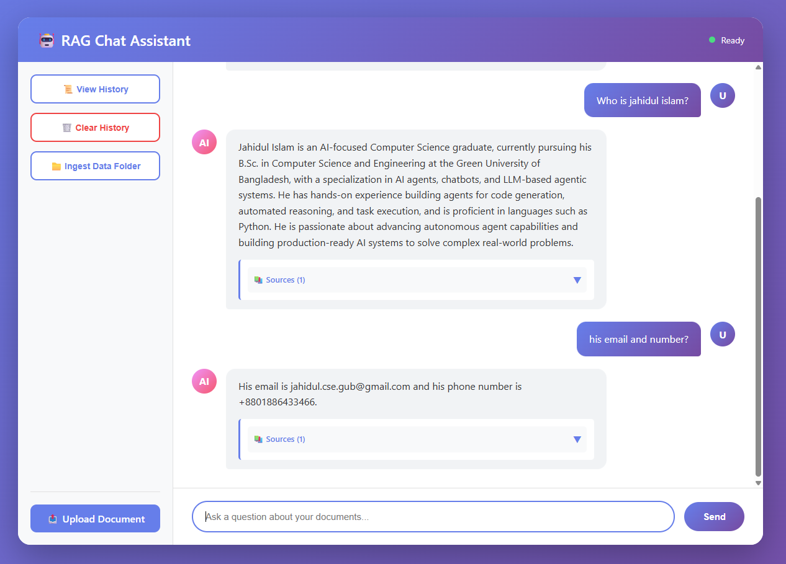

# RAG Application with API

A professional Retrieval Augmented Generation (RAG) application built with LangChain and GROQ API. Features both a **FastAPI web interface** and a **CLI** for document-based Q&A with conversation memory.



## 🌟 Features

- **🌐 Web Interface**: Modern, responsive chat UI with real-time interaction
- **⚡ FastAPI Backend**: RESTful API with automatic documentation
- **📄 Document Ingestion**: Support for multiple file formats (PDF, TXT, Markdown, CSV)
- **🧠 Vector Store**: Efficient document retrieval using FAISS and HuggingFace embeddings
- **🤖 GROQ API Integration**: Custom LangChain wrapper for GROQ API with fast inference
- **💬 Conversation Memory**: Maintains chat history for intelligent follow-up questions
- **🖥️ Interactive CLI**: User-friendly command-line interface
- **📤 File Upload**: Web-based document upload and processing
- **🔄 Session Management**: Multi-user support with isolated sessions
- **Source Citations**: Answers include references to source documents
- **Professional Architecture**: Modular, maintainable, and extensible codebase


## 🚀 Getting Started

### Prerequisites

- Python 3.8 or higher
- GROQ API key (from groq.com)

### Installation

1. **Clone or navigate to the project directory**

2. **Install dependencies**
   ```powershell
   pip install -r requirements.txt
   ```

3. **Set up environment variables**
   
   Copy `.env.example` to `.env`:
   ```powershell
   Copy-Item .env.example .env
   ```
   
   Edit `.env` and add your GROQ API key:
   ```
   GROQ_API_KEY=your_actual_api_key_here
   ```

4. **Add documents to the data directory**
   
   Place your documents (PDF, TXT, MD, CSV) in the `data/` directory:

## 💻 Usage

### Option 1: Web Interface (Recommended)

1. **Start the server:**
   ```powershell
   .\start_server.ps1
   ```
   
   Or manually:
   ```powershell
   python -m uvicorn api.main:app --host 0.0.0.0 --port 8000 --reload
   ```

2. **Access the application:**
   - **Web UI**: http://localhost:8000
   - **API Docs**: http://localhost:8000/docs
   - **ReDoc**: http://localhost:8000/redoc

3. **Use the interface:**
   - Type questions in the chat input
   - Upload documents via the UI
   - View conversation history
   - Get source citations with answers

### Option 2: Command Line Interface

### 1. Ingest Documents dir

Ingest documents from the data directory:
```powershell
python rag_app.py ingest ./data
```

Ingest a specific file:
```powershell
python rag_app.py ingest ./data/document.pdf
```

### 2. Query the System

Ask a single question:
```powershell
python rag_app.py query "What is the main topic of the documents?"
```

Ask without showing sources:
```powershell
python rag_app.py query "Summarize the key points" --no-sources
```

### 3. Interactive Mode

Start an interactive Q&A session:
```powershell
python rag_app.py interactive
```

In interactive mode:
- Type your questions and press Enter
- Ask follow-up questions naturally (e.g., "What about X?", "Tell me more about it")
- Type `clear` to reset conversation history
- Type `history` to view conversation history
- Type `exit`, `quit`, or `q` to end the session
- Use Ctrl+C to interrupt


## 🌐 API Usage

See [API/README.md](README.md) for comprehensive API documentation.

**Check Status:**
```bash
curl "http://localhost:8000/api/status"
```


## ⚙️ Configuration

Edit `config.py` or `.env` file to customize:

- `GROQ_API_KEY`: Your GROQ API key (required)
- `MODEL_NAME`: GROQ model to use (default: `llama-3.3-70b-versatile`)
- `TEMPERATURE`: Response creativity (0.0-1.0, default: 0.7)
- `CHUNK_SIZE`: Document chunk size (default: 1000)
- `CHUNK_OVERLAP`: Overlap between chunks (default: 200)
- `TOP_K_RESULTS`: Number of relevant docs to retrieve (default: 4)

## 🏗️ Architecture

### Components

1. **FastAPI Application** (`api/main.py`)
   - RESTful API with automatic documentation
   - Session management for multiple users
   - File upload and document processing endpoints

2. **Web Interface** (`frontend/index.html`)
   - Modern, responsive chat UI
   - Real-time conversation
   - File upload and source citations

3. **GrokLLM** (`src/grok_llm.py`)
   - Custom LangChain LLM wrapper for GROQ API
   - Handles API communication and response parsing

2. **VectorStoreManager** (`src/vectorstore_manager.py`)
   - Manages FAISS vector database
   - Handles document embedding and retrieval

3. **DocumentProcessor** (`src/document_processor.py`)
   - Loads documents from various formats
   - Splits documents into chunks for processing

4. **RAGChain** (`src/rag_chain.py`)
   - Implements the RAG pipeline with conversation memory
   - Combines retrieval and generation
   - Handles follow-up questions intelligently

5. **CLI Application** (`rag_app.py`)
   - Main application orchestrator
   - CLI interface implementation

### Data Flow

```
Documents → DocumentProcessor → Chunks → VectorStore
                                              ↓
User Query → RAGChain → Retrieval → Context + Query → GrokLLM → Answer
```

## 🔍 Examples

### Example 1: Research Assistant
```powershell
# Ingest research papers
python rag_app.py ingest ./data/research_papers

# Query
python rag_app.py query "What are the main findings about climate change?"
```

### Example 2: Documentation Search
```powershell
# Ingest documentation
python rag_app.py ingest ./data/docs

# Interactive mode for multiple questions
python rag_app.py interactive
```

## 🛠️ Development

### Adding New Document Formats

Edit `src/document_processor.py` and add a new loader in the `load_document` method:

```python
elif suffix == ".docx":
    from langchain_community.document_loaders import Docx2txtLoader
    loader = Docx2txtLoader(str(file_path))
```

### Customizing the RAG Chain

Modify the prompt template in `src/rag_chain.py`:

```python
template = """Your custom prompt template here..."""
```

### Using Different Embeddings

Change the embedding model in `config.py`:

```python
EMBEDDING_MODEL = "sentence-transformers/your-model-here"
```

## 📝 Error Handling

Common issues and solutions:

1. **"GROQ_API_KEY is required"**
   - Ensure `.env` file exists with valid API key

2. **"Vectorstore not initialized"**
   - Run `ingest` command before querying

3. **"No documents found"**
   - Check that documents are in the data directory
   - Verify file formats are supported

## 🔒 Security

- Never commit `.env` file to version control
- Keep your API keys secure
- Use environment variables for sensitive data

## 📄 License

This project is provided as-is for educational and commercial use.

## 🤝 Contributing

Contributions are welcome! Please:
1. Fork the repository
2. Create a feature branch
3. Make your changes
4. Submit a pull request

## 📧 Support

For issues or questions, please check:
- GROQ API documentation: https://console.groq.com/docs
- LangChain documentation: https://python.langchain.com

## 🎯 Roadmap

- [ ] Add support for more document formats (DOCX, HTML, etc.)
- [ ] Implement conversation history
- [ ] Add web UI interface
- [ ] Support for multiple vector stores (Pinecone, Chroma)
- [ ] Batch processing for large document sets
- [ ] Query caching for improved performance
- [ ] Multi-language support

---

Built with ❤️ using LangChain and GROQ API
